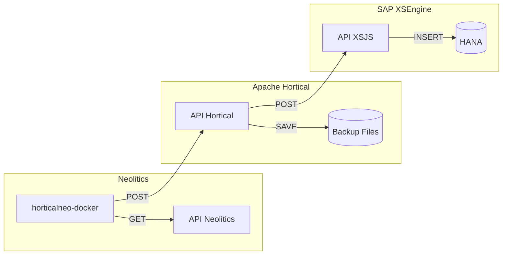

# hortifrut-calidad-horticalneo

API de consumo de registros desde Neolitics hacia Hortical  
`horticalneo.jar`

---

## 📌 Descripción

API encargada del traspaso de información desde los servidores de Neolitics hacia el sistema de calidad de Hortifrut (Hortical).

---

## ⚙️ Tecnologías utilizadas

- Maven  
- Java 1.8  
- Docker 28.5.2  

---

## 🚀 Instalación

1. Instalar Docker  
2. Generar el archivo `.jar`:
   ```bash
   horticalneo.jar
   ```
3. Subir el archivo al servidor Hortical:  
   ```
   https://syscalidad.hortifrut.com/hana/files/origen/neolitics/horticalneo.jar
   ```
4. Ejecutar el `Dockerfile` ubicado en la carpeta `/docker`  
5. Levantar el contenedor Docker  

---

## 📋 Requisitos

El acceso a las APIs de Neolitics solo es posible desde sus servidores.  
Para ejecutar el sistema en una instancia Docker externa, es necesario contar con una conexión vía VPN.

---

## 🔄 Flujo del sistema

